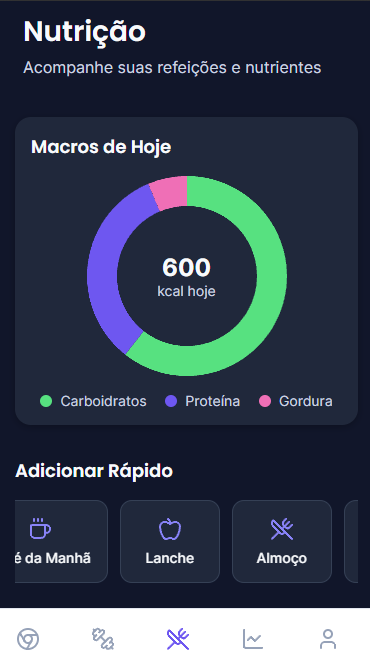
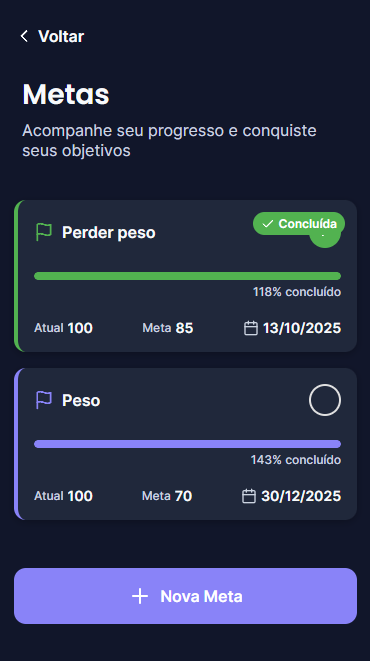

<div align="center">
  
  <h1>ZenMotion - Frontend</h1>
  <p>Aplicativo móvel multiplataforma para a jornada de saúde e bem-estar, construído com React Native e Expo.</p>

  <p>
    
    
    
    
  </p>
</div>

## 👨‍💻 Autores

**[Daniel Lucas dos Santos Corte - 202403517949]** - [daniellcorte@gmail.com](mailto:daniellcorte@gmail.com) <br>
**[Julio Alexsandro Monteiro da Silva - 202403945487]** - [julioalexsandro.monteiro13@gmail.com](mailto:julioalexsandro.monteiro13@gmail.com)

---

## 🖼️ Telas do Aplicativo

<p align="center">
  
  
  
</p>

---

## 🎯 Sobre o Projeto

Este repositório contém o código-fonte do **aplicativo móvel ZenMotion**. Ele foi desenvolvido com React Native e Expo para oferecer uma experiência de usuário fluida e intuitiva em dispositivos iOS e Android.

O aplicativo consome a [API do backend do ZenMotion](https://github.com/zenmotion/backend) para fornecer todas as funcionalidades, como login, registro de refeições, monitoramento de exercícios e visualização de progresso.

---

## 🚀 Tecnologias Utilizadas

* **React Native**
* **Expo SDK**
* **TypeScript**
* **Axios** (para requisições à API)
* **React Navigation** (para gerenciamento de rotas e navegação)
* **Styled Components** (para estilização)

---

## 🏁 Começando

Siga estas instruções para configurar e executar o aplicativo em sua máquina local ou em seu celular.

### Pré-requisitos

* [**Node.js**](https://nodejs.org/en/) (versão LTS)
* O aplicativo **Expo Go** em seu smartphone (disponível na App Store e Play Store).
* O **servidor do backend do ZenMotion** deve estar rodando localmente.

### Instalação e Execução

1.  **Clone este repositório:**
    ```bash
    git clone https://github.com/zenmotion/zenmotion.git
    cd zenmotion
    ```

2.  **Crie o arquivo de ambiente:**
    * Na raiz do projeto frontend, crie um arquivo chamado `.env`.
    * Dentro deste arquivo, adicione a seguinte linha, que informa ao aplicativo onde encontrar a API do backend:
        ```
        API_BASE_URL=[http://127.0.0.1:8000](http://127.0.0.1:8000)
        ```

3.  **Instale as dependências:**
    ```bash
    npm install
    ```

4.  **Inicie o servidor de desenvolvimento:**
    ```bash
    npm run dev
    ```

5.  **Execute o aplicativo:**
    * O Metro Bundler será iniciado e um **QR Code** aparecerá no seu terminal.
    * Abra o aplicativo **Expo Go** em seu celular e escaneie o QR Code.
    * 🎉 O aplicativo ZenMotion será carregado em seu dispositivo!

